# APB-protocol
In B.E Final Year Project, I tackled the design and verification of the APB protocol, a crucial element for on-chip communication. By leveraging the UVM, I constructed a comprehensive test environment. This environment included components like a sequencer, driver, and monitor, enabling thorough testing of the APB protocol's functionality.
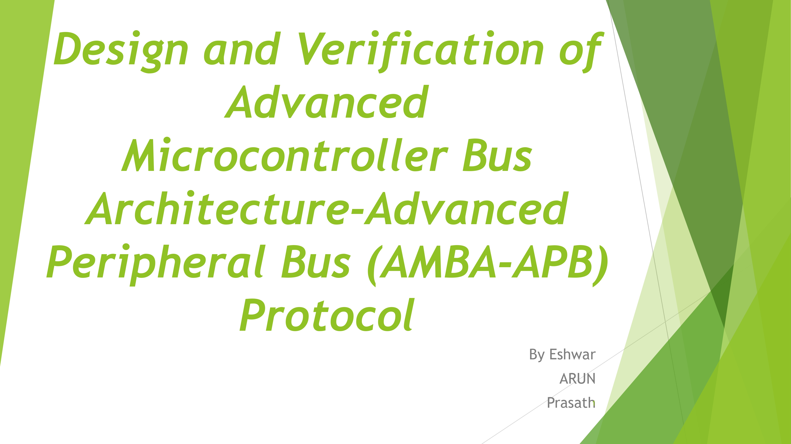 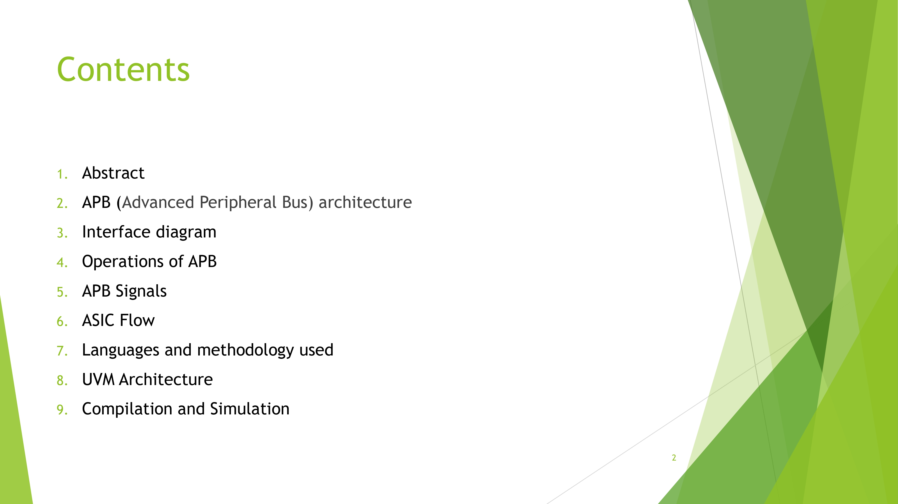 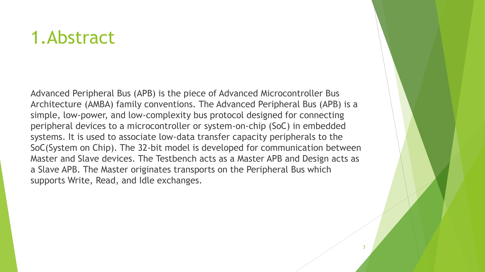 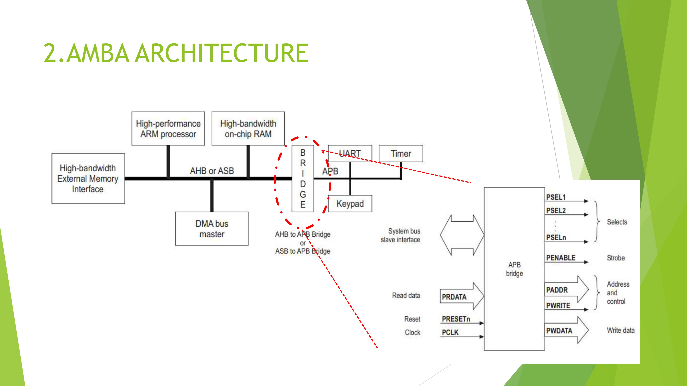 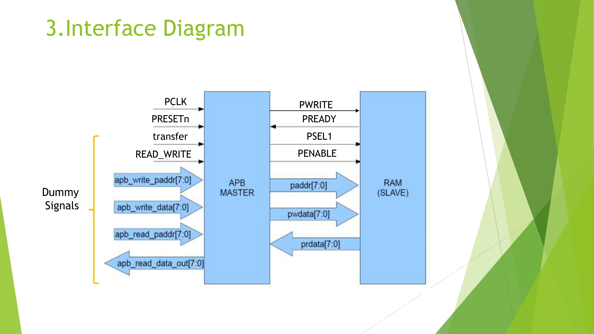 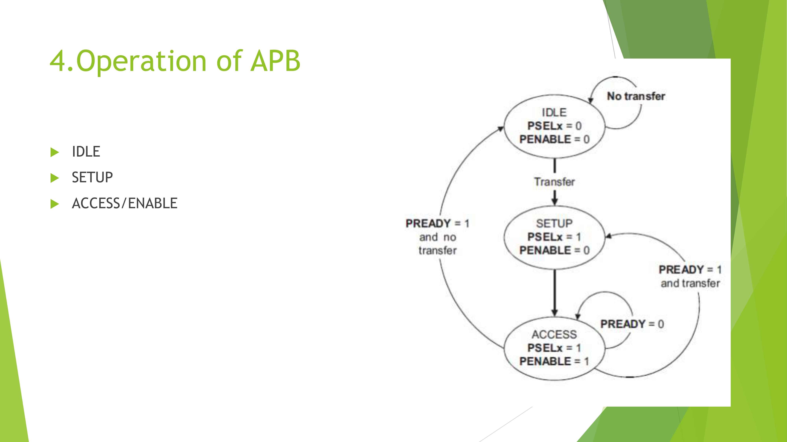 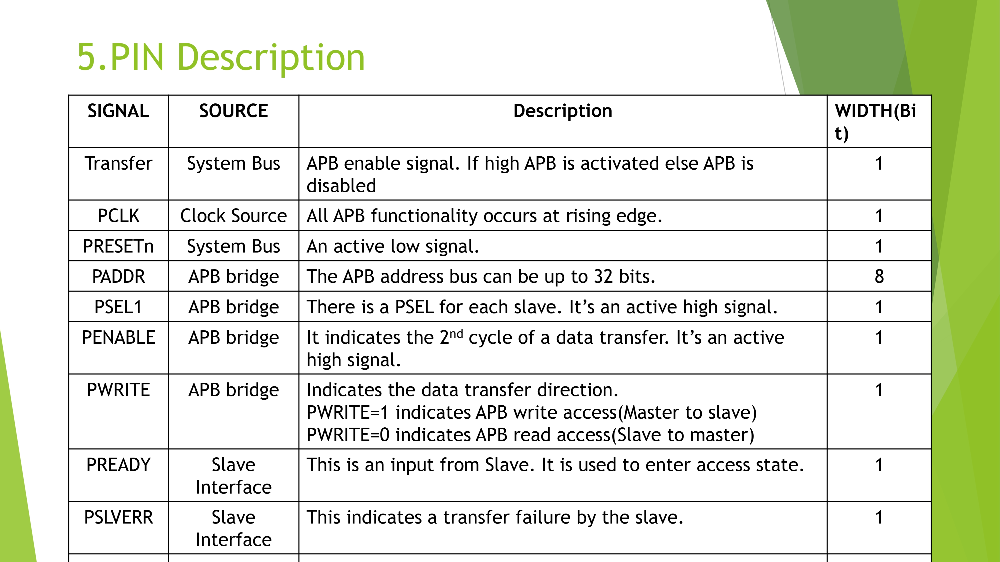 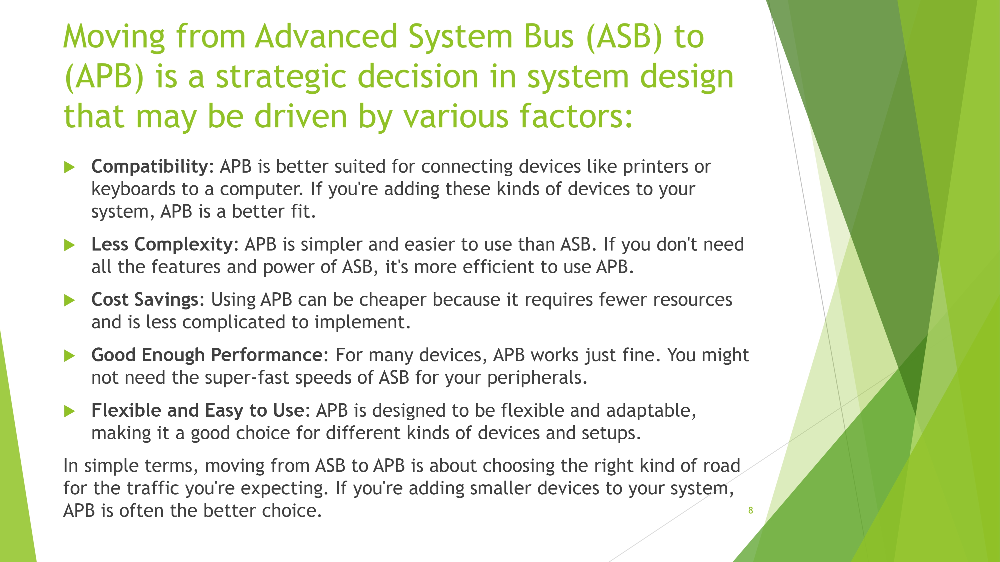 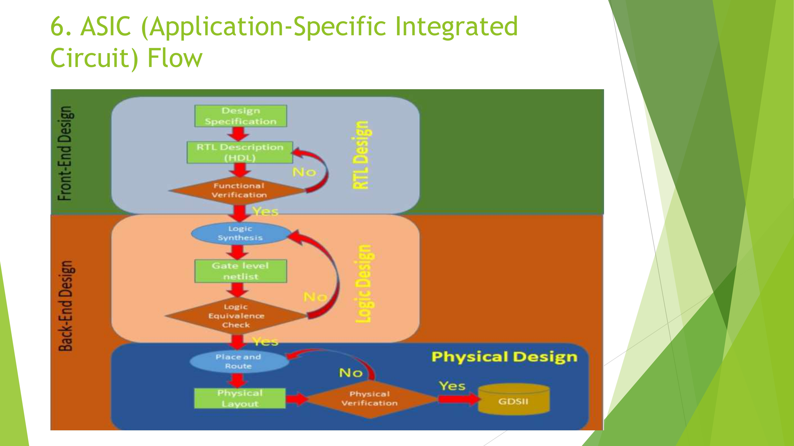 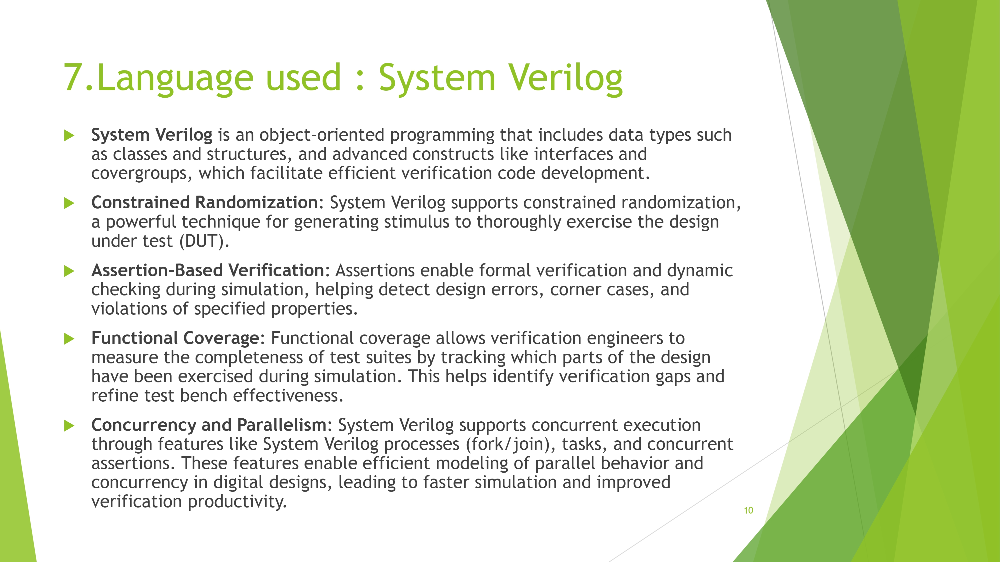 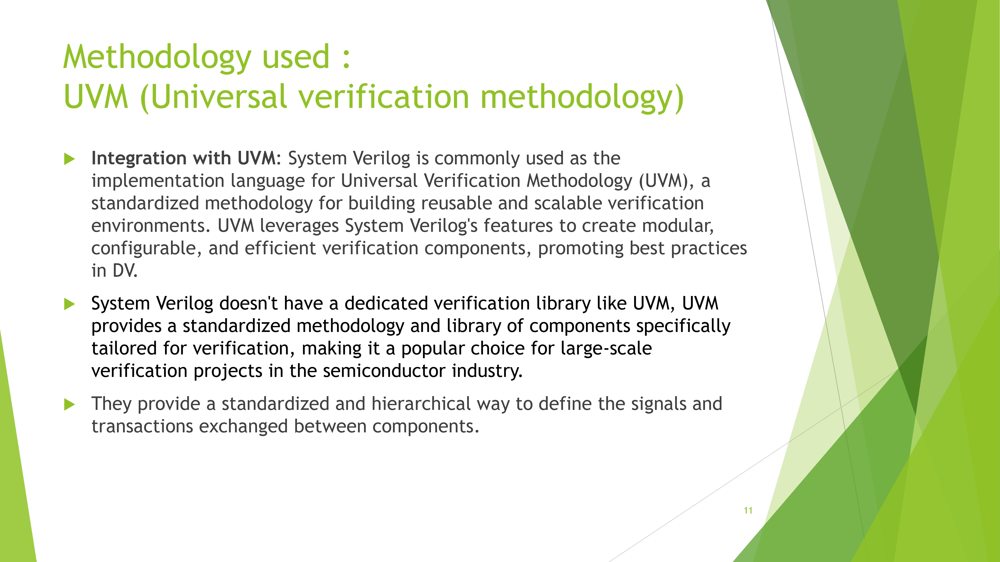 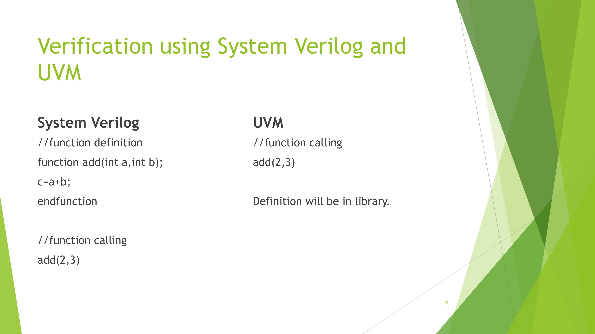 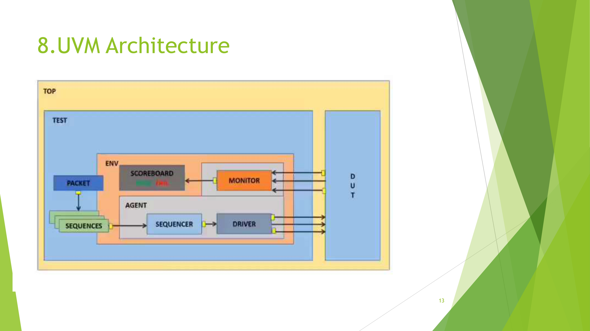 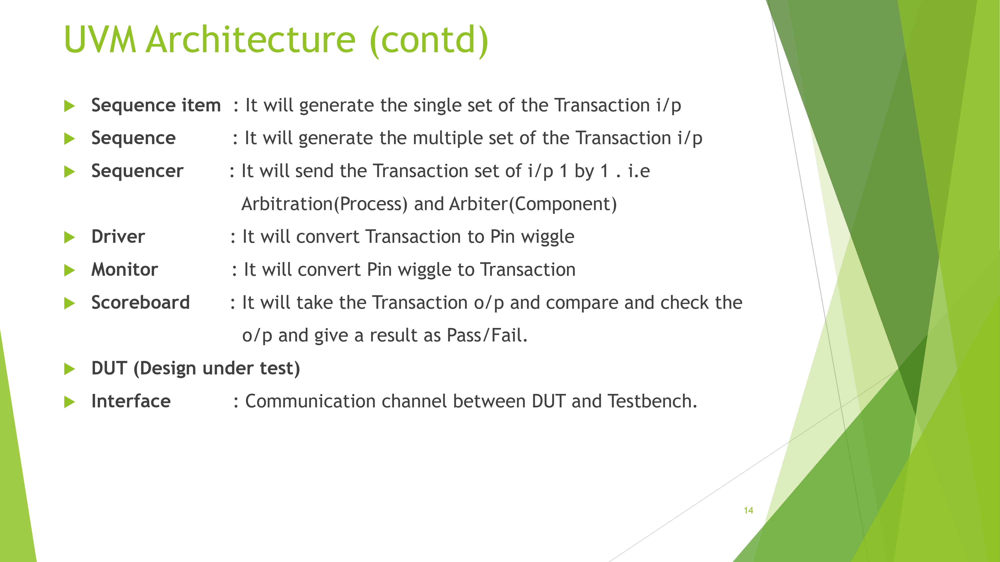  